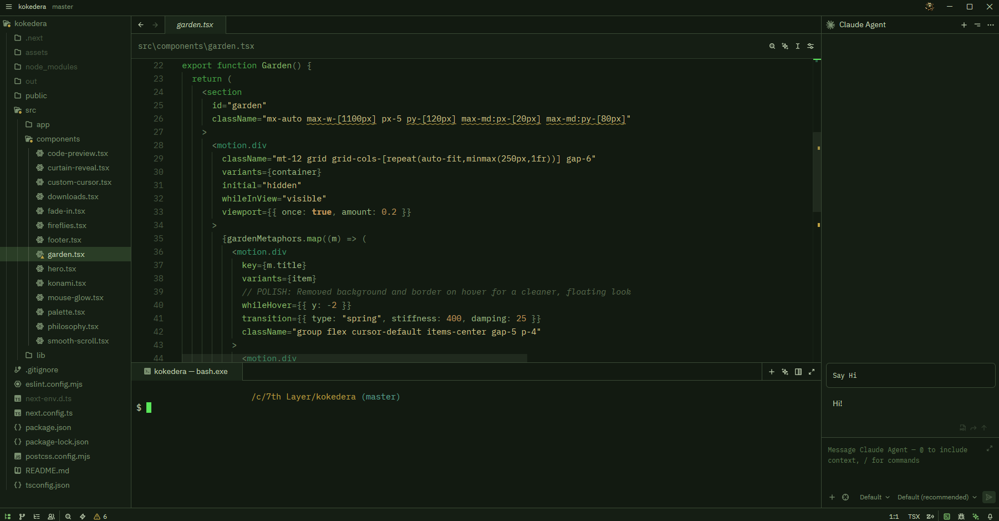

# 苔寺 Kokedera

*A dark color theme for [Zed](https://zed.dev), inspired by the moss temple garden in Kyoto.*

---

## About

**Kokedera** (苔寺, *Temple of Moss*) is a meditative dark theme inspired by **Saihō-ji** — the ancient moss garden in Kyoto. The palette grows from a single source: the patient green of moss, accented by lantern amber, cedar teal, and stone gray.

## Installation

1. Open **Zed**
2. Open the command palette: `Cmd+Shift+P` (macOS) / `Ctrl+Shift+P` (Linux)
3. Search for **"zed: extensions"**
4. Search for **"Kokedera"**
5. Click **Install**
6. Open command palette again and search for **"theme selector: toggle"**
7. Select **Kokedera**

## Palette

| Role | Hex |
|------|-----|
| Background | `#121a11` |
| Surface | `#151e14` |
| Selection | `#2a3d26` |
| Border | `#3a4a35` |
| Text | `#c8d8b8` |
| Keywords | `#4ca64c` |
| Strings | `#d4c88e` |
| Functions | `#8fbf6f` |
| Types | `#3d9970` |
| Variables | `#a3be8c` |
| Numbers | `#c49a5c` |
| Comments | `#5a6b50` |
| Cursor | `#5ae65a` |
| Errors | `#c45a5a` |
| Warnings | `#bfa243` |

## Pair with the icon pack

- **[Kokedera Icons](https://github.com/7th-Layer/kokedera-icons-extension-zed)** — matching file & folder icons

## Also available for

- [Visual Studio Code](https://marketplace.visualstudio.com/items?itemName=7th-Layer.kokedera-theme)
- [JetBrains IDEs](https://plugins.jetbrains.com/plugin/30629-kokedera--japanese-moss-temple-theme)

## License

[MIT](LICENSE)

---

[kokedera.style](https://kokedera.style)
